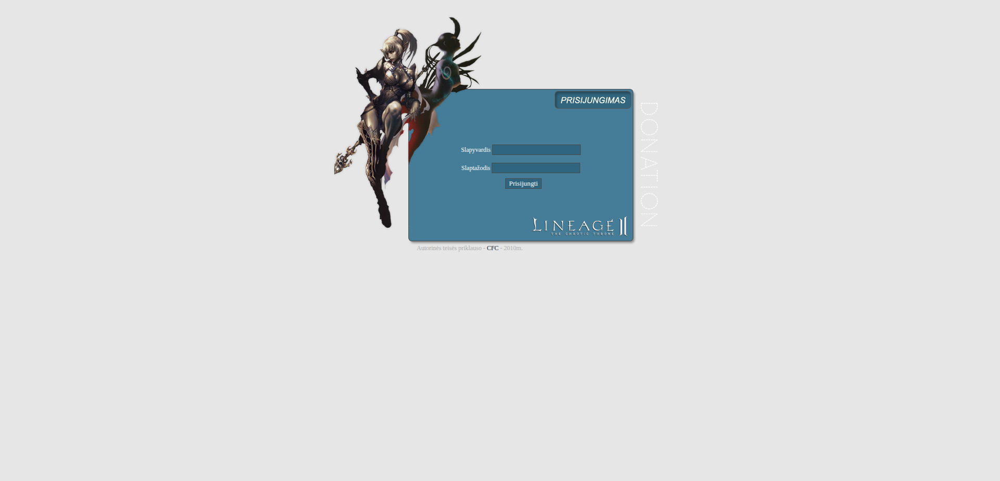
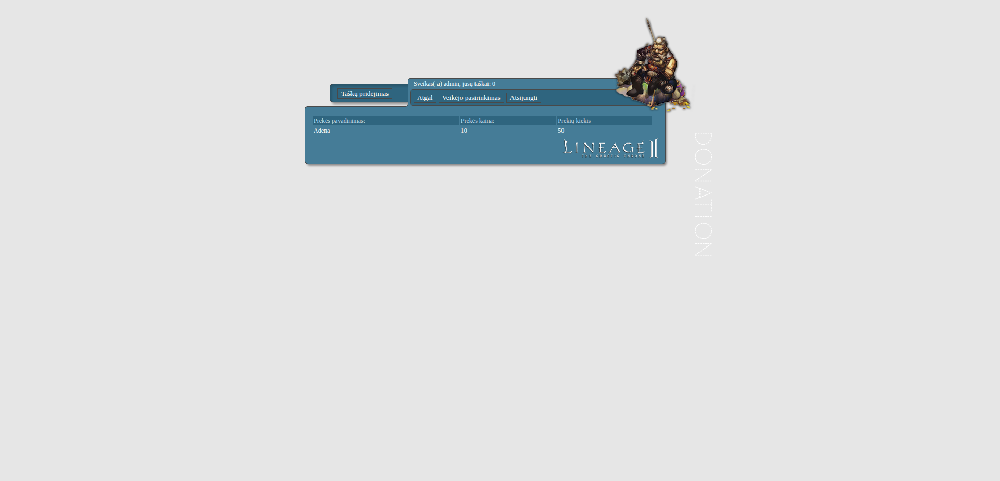
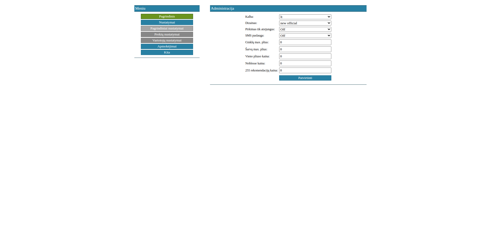

## History
L2J Donate System v1.5.1 was originally released around 2010 and was built with plain HTML, CSS, JavaScript and PHP.

This was not the first version of the system. The earliest versions probably go back to around 2008, maybe even earlier, 
but I don't have them anymore. Version 1.5.1 is the oldest complete copy I managed to find, so this is where I'm 
starting again.

For me, this project is much more than just some old PHP code. It was one of those projects I could spend countless 
hours on without getting bored. I remember constantly changing things, breaking things, fixing them again, learning 
new tricks, and being genuinely excited when some small feature finally worked the way I wanted. It was my little baby 
project, and opening these files again after so many years brings back a lot of memories from 
that time.

I'm not bringing it back because I want to turn it into something huge, modern, or commercially successful. 
I'll work on it in my spare time simply because I still love it. Maybe almost nobody will use it anymore, 
although somehow there are still people running different versions of this system even today. That alone makes me smile.

Looking at the code now, something like this may seem pretty simple to build. But around 2010 it really wasn’t. 
Making this version took a lot of time, trial and error, late nights, reading documentation, searching forums, 
debugging strange problems, and figuring things out on my own. There was no AI generating code or explaining 
errors for you.

That is also why I want to keep this project AI-free. I want to go through my old code myself, remember how I used to 
think, fix the things that need fixing, improve what feels right, and have some fun with it again.

I don't know where this project will go, and that's completely fine. I just want to keep a small piece of my old 
developer life alive.

## Requirements and how to run it in modern times

This project is old, so running it today requires a slightly different setup than it did back then.

At the moment I am running it with:

PHP 5.6
MariaDB 11.4
L2J C4 server

I use Docker for the whole environment, which makes it much easier to run older PHP versions and keep everything 
isolated from the host system. Docker is not required, but it is probably the easiest way to run the project on a 
modern machine without installing old dependencies directly on your system.

If you want to run the project using Docker as well, feel free to contact me. I can share the Docker files and 
configuration I currently use to run the system locally.

## Screenshots

This is some screenshots from version 1.5.1

